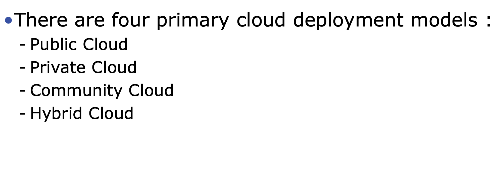
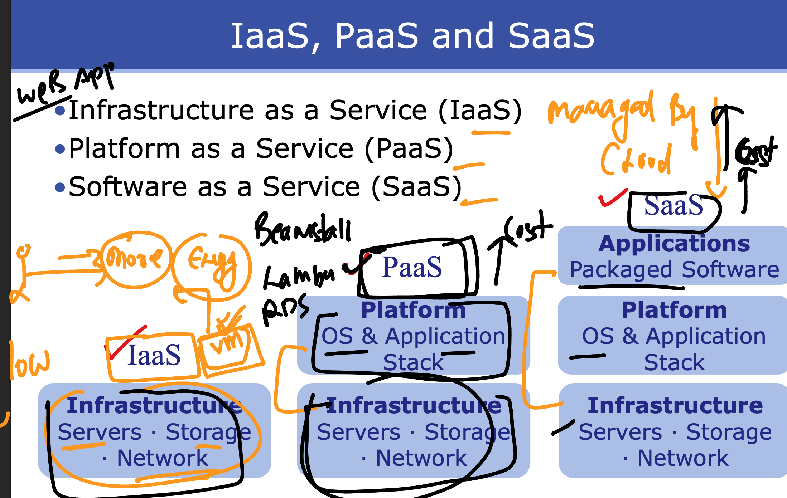

# walmart_TPM_CLOUD_15thsept2025

## In cloud system  scalling understanding 


## HA in cloud with cloud region and AvZone 


### cloud deployment Model 



### How cloud is offering service to USers



### Deploying webapp consideration 


## setup webapp in centos 9 stream server vm 

### Inastalling git cli 

```
[ashutoshhsingh93@ashuvm1 ~]$ sudo dnf install git -y 
Last metadata expiration check: 0:17:09 ago on Mon 15 Sep 2025 06:10:32 PM UTC.
Dependencies resolved.
===============================================================================================================================================
 Package                                   Architecture              Version                                Repository                    Size
===============================================================================================================================================
Installing:
 git                                       x86_64                    2.47.3-1.el9                           appstream                     51 k
Installing dependencies:
 emacs-filesystem                          noarch                    1:27.2-18.el9                          appstream                    9.2 k
 git-core                    

 ```

 ### clone the code 

 ```
 [ashutoshhsingh93@ashuvm1 ~]$ git clone https://github.com/schoolofdevops/html-sample-app.git
Cloning into 'html-sample-app'...
remote: Enumerating objects: 74, done.
remote: Counting objects: 100% (3/3), done.
remote: Compressing objects: 100% (3/3), done.
remote: Total 74 (delta 0), reused 0 (delta 0), pack-reused 71 (from 1)
Receiving objects: 100% (74/74), 1.38 MiB | 8.08 MiB/s, done.
Resolving deltas: 100% (5/5), done.
[ashutoshhsingh93@ashuvm1 ~]$ ls
html-sample-app
[ashutoshhsingh93@ashuvm1 ~]$ ls html-sample-app/
assets  elements.html  generic.html  html5up-phantom.zip  images  index.html  LICENSE.txt  README.txt
[ashutoshhsingh93@ashuvm1 ~]$ 

```
