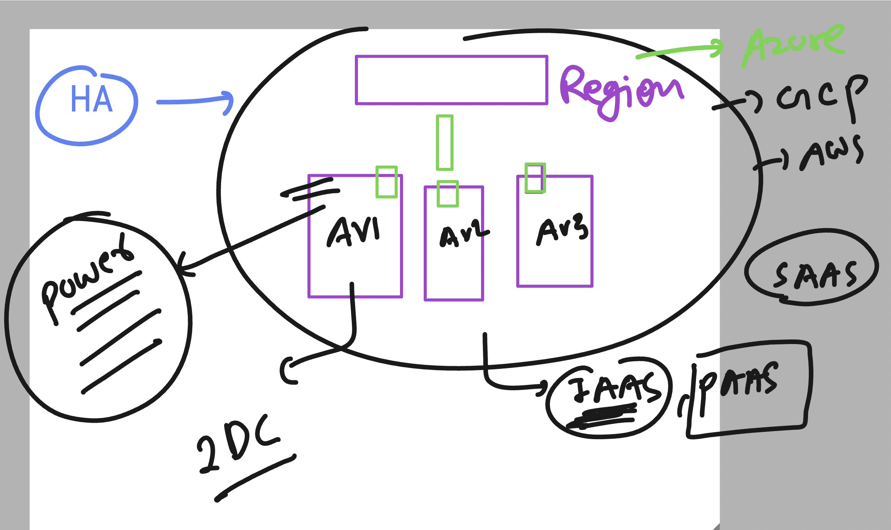
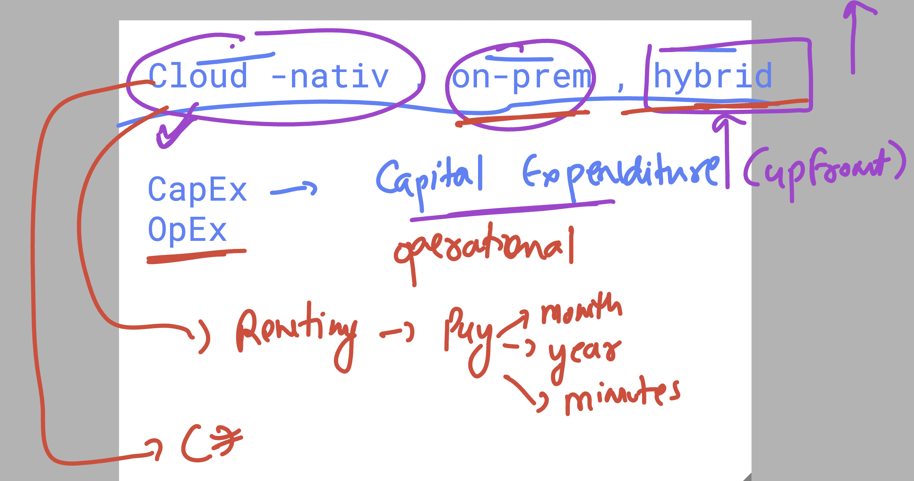

# walmart_TPM_CLOUD_15thsept2025

### Revision -for Decision Framework 

### options to use cloud service --- by service model 

### for HA -- Region , av zones

## Understanding CapEx vs OpEX 

### CLoud IAAS pricing model understanding 

## Understanding monolith system desing of app 

## in Microservices framework of desing -- vm vs containrs 

## solving problems of containers in scale env using K8s / openshift 

