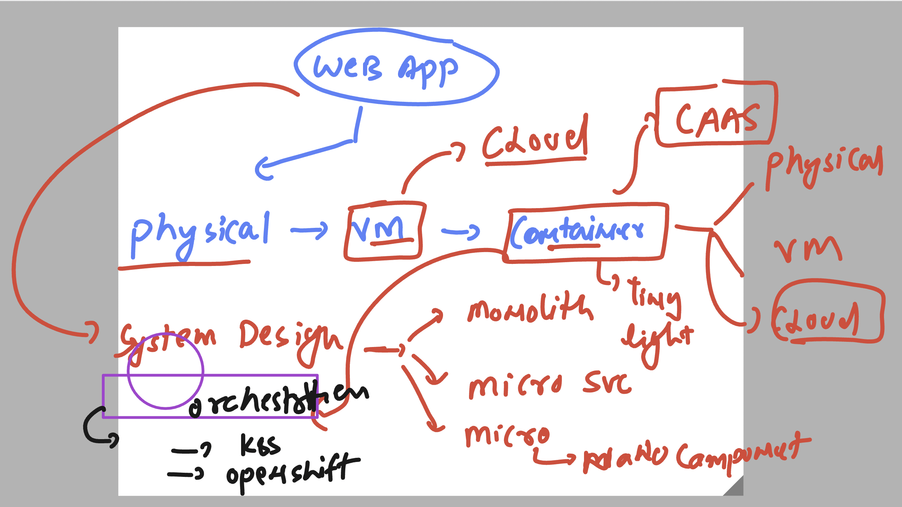
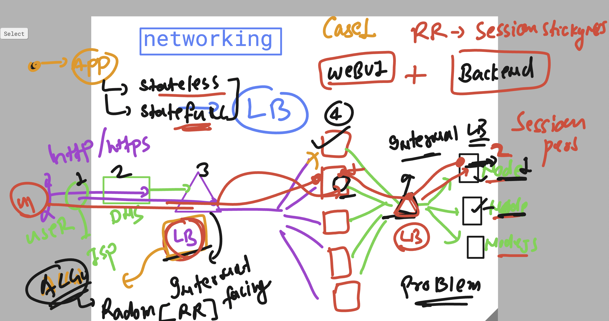
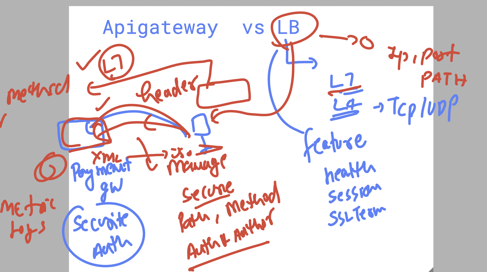
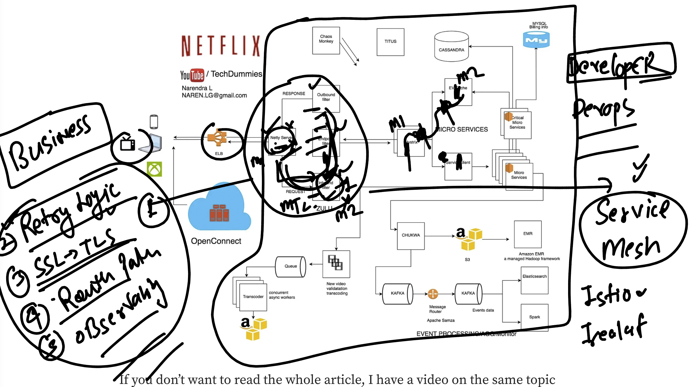

# walmart_TPM_CLOUD_15thsept2025

### QUick revision 

### Session affinity / session stickyness / session persistent in LB 

### Apigw vs LB 

## securing communitcation and couple methods in microservices using service mesh

### Secure desing pattern options 

### tools for sast and dast 

## project by teams 

 Capstone Project: TPMs Design & Present a System

## Assignment

Teams will design a system (example options: **ridesharing backend** or **video streaming platform**). The following aspects must be addressed:

- **Cost vs. performance vs. maintainability**
- **Build vs. buy considerations**
- **Managing dependencies**
- **System and architecture diagrams**
- **PRD (Product Requirement Document) outline**

## Tools for Reference

- Whiteboard or Lucidchart for diagrams
- GCP/Azure consoles for pricing and service comparisons

## Peer Review

- Each team presents their solution
- Other teams and instructor provide structured feedback

====> project 

# walmart_TPM_CLOUD_15thsept2025

### QUick revision 

### Session affinity / session stickyness / session persistent in LB 

### Apigw vs LB 

## securing communitcation and couple methods in microservices using service mesh

### Secure desing pattern options 

### tools for sast and dast 

## project by teams 

 Capstone Project: TPMs Design & Present a System

## Assignment

Teams will design a system (example options: **ridesharing backend** or **video streaming platform**). The following aspects must be addressed:

- **Cost vs. performance vs. maintainability**
- **Build vs. buy considerations**
- **Managing dependencies**
- **System and architecture diagrams**
- **PRD (Product Requirement Document) outline**

## Tools for Reference

- Whiteboard or Lucidchart for diagrams
- GCP/Azure consoles for pricing and service comparisons

## Peer Review

- Each team presents their solution
- Other teams and instructor provide structured feedback