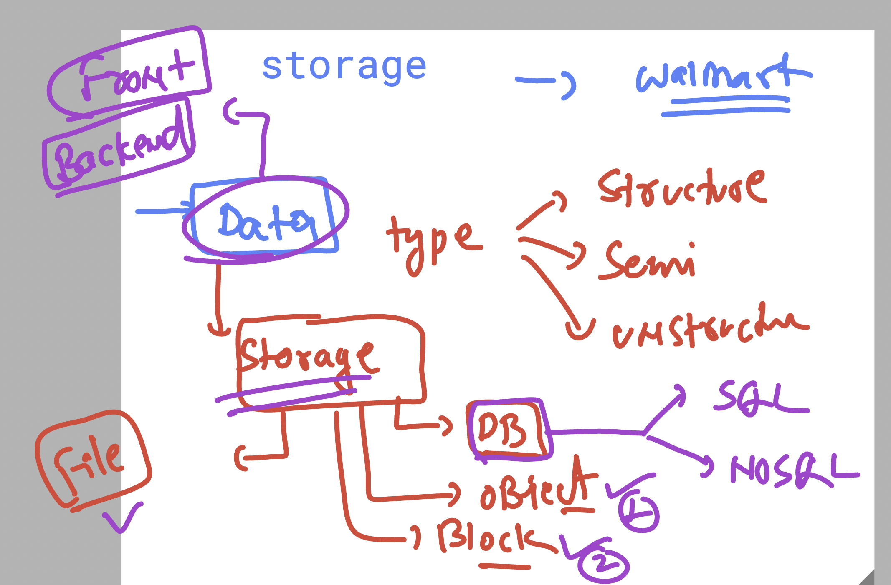
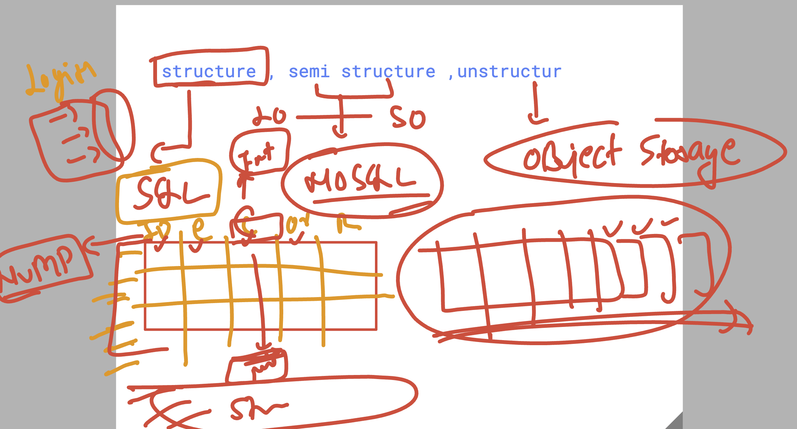

# walmart_TPM_CLOUD_15thsept2025

## story of storage in cloud env 

### understanding to differnt type of storage 

### storage --> compare

# 📊 Object Storage vs Databases Comparison

| Feature / Question | Object Storage (Blob, GCS, S3) | Databases (SQL / NoSQL) |
|-------------------|--------------------------------|------------------------|
| What is it? | Stores files/objects (images, videos, docs, backups) | Stores structured or semi-structured data (rows, tables, JSON, key-value) |
| Data Type | Unstructured or semi-structured (binary, text, media) | Structured (SQL tables) or semi-structured (NoSQL JSON, key-value) |
| Access Pattern | Access via URL or API; retrieve entire object | Query with SQL/NoSQL; can fetch specific fields/rows |
| Scalability | Virtually infinite, scales automatically | Scales well, but needs planning (read replicas, sharding) |
| Performance | High throughput, but slower for fine-grained queries | Optimized for queries and transactions |
| Use Case Examples | • Walmart product images • Receipts • CCTV footage • App backups | • Orders • Inventory • Customer data • Shopping cart sessions |
| Cost | Very cheap per GB (esp. archive tiers) | Higher cost (compute + storage + licensing) |
| Durability/Redundancy | Built-in replication (multi-region storage options) | Data replication available but adds cost/complexity |
| Query Support | ❌ Cannot query inside object (need external tools like BigQuery or Athena) | ✅ Queryable (SQL joins, NoSQL lookups, search) |
| When to Use | • Store large files/media • Archive or backups • Static content delivery (CDN) | • Store transactions • Need real-time queries • Business logic depends on relationships in data |